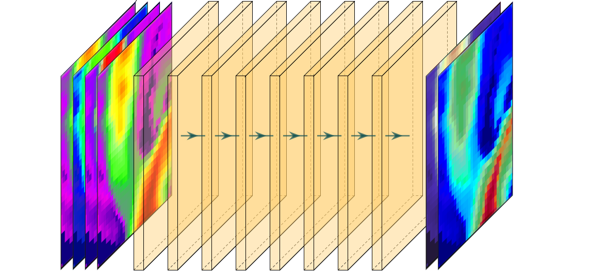

### <h1 align="center" id="title">The 2D to 2D Deep Learning Emulator (2Dto2D-DLE) </h1>

# Overview

The 2D to 2D Deep-Learning Emulator (2Dto2D-DLE) is a Python code that builds and trains convolutional neural networks, which map multi-channels 2D gridded inputs to ouputs and capture spatial patterns from data. DLE was originally designed to emulate ice flow dynamics from topographical inputs, but can be usefull for other geophysical applications dealing with 2D gridded I/O (from physical models or real obervations).

 
# Installing Python Packages

2Dto2D-DLE is written in Python and requires the installation of few libraries such as numpy, matplotlib, netCDF4, tensorflow (version 2.4.0 or later), and keras libraries. The library [keras-unet-collection](https://github.com/yingkaisha/keras-unet-collection) is necessary to use unet-like network.

It is almost necessary to run the training on a GPU. For that purpose, you need to additionally install i) cuda ii) cudnn iii) tensorflow-gpu. **Make sure that i) cuda ii) cudnn iii) tensorflow iv) python versions are [compatible](https://www.tensorflow.org/install/source#gpu), and your Nvidia driver is [compatible](https://docs.nvidia.com/deploy/cuda-compatibility/) with the version of cuda. Such incompatibility is the most common source of issue.** 

I recomend creating a dedicated python environment 'dle' typing the following comands (here we use conda):

	conda create --name igm python=3.7
	conda activate dle
	conda install matplotlib numpy netCDF4 
	conda install cudatoolkit=11.0 cudnn=8.0 -c conda-forge 
	pip install tensorflow==2.4.0 tensorflow-gpu==2.4.0 keras
	pip install keras-unet-collection # this is necessary if you plan using a unet instead of CNN
	pip install -U protobuf           # this is necessary for TF 2.5.0
	
# Quick start

Once you have installed the above packages, there is a ready-to-use example in the folder `examples/` with scripts to download minimal data and run 2Dto2D-DLE.

# About the code

The 2Dto2D-DLE code is packed into a single file `src/dle.py`, which defines the class `dle` and contains all what we need -- variables and functions. Just explore it.

# The most simple usage

The easiest way to run 2Dto2D-DLE is to type in a Unix terminal (under the right python environment):

	cp ../src/dle.py .
	python -c "from dle import dle ; dle = dle() ; dle.run()" --usegpu True

which imports the dle class, create an element of the dle class and run it with desired options like `--usegpu True`. The list of options can be checked just adding `--help`. Here are the most important ones:
 
  	--dataset             Name of the folder containing 'train' and 'test' 
  	--train               Set this to True to train (True)
  	--predict             Set this to True to predict (True)
  	--network             Type of Network (cnn or unet)
  	--loss                Type of loss: mae or mse (mae)
  	--resample_data       Resample data resolution down or up by this factor (1)
  	--data_augmentation   Apply data augmentation (True)
 	--data_stepping       Skip data frames -- usefull for quick tests (1)
  	--epochs              Number of epochs (100)
 	--patch_size          Patch size -- if negative it takes the highest possible (32)
  	--data_dir            Path of the data folder ('')
 	--results_dir         Path of the result folder ('')
 	--usegpu              Use the GPU, this is almost mandatory in practice (True)

# Inputs/Outputs (I/O)

Your data should be contained in a folder with name defined by --dataset, and path defined by --data_dir. You must always supply the data in two folders ('train' and 'test'). The first will contain the data you want to learn from, while the second contains the data you reserve for validation. Each folder contains a single or a suite of folders containing data. Default format for input data is NetCDF file, but npy is also accepted. For NetCDF files, all gridded variables (e.g. usurf, ubar) must be contained in a single file (e.g. 'ex.nc') and should have the follwing shape (Nt,Ny,Nx) where Nt is time dimension and (Ny,Nx) are spatial dimensions. For npy files, the same shape applies, but variables are stored in separate files nameofvariable.npy (e.g. usurf.npy, ...)

# Choice of the Network 

2Dto2D-DLE implements standard [Convolution Neural Network](https://en.wikipedia.org/wiki/Convolutional_neural_network) (--network cnn) and [U-net](https://en.wikipedia.org/wiki/U-Net) (--network unet). A Unet can be seen as a multi-scale CNN, which performs convolutions at different zoom levels to capture patterns at various scales. Note that while CNN can take any frame size in Input/Output, Unet I/O frames must be a multiple of 2^N (N=3 usually). 

# Choice of I/O data

You also must define i) the list input and output fields (or chanels) ii) typical values of each fields to normalize the data. For that purpose, you may use pre-defined emulator type with --maptype (e.g. --maptype f2 maps ["thk", "slopsurfx", "slopsurfy"] inputs to ["ubar","vbar"] output fields -- check at dle.py for more models). Alternatively, you may define your own mapping with input and output variable names (and scaling values) in user-defined fieldin.dat and fieldout.dat files. In that case --maptype defines the path of these two input files. You have to make sure that the input / output variables are defined in your data (e.g. exists in the NetCDF file, or as npy file). There is an expection for fields 'slopsurfx' and 'slopsurfy' (e.g. the gradients of 'usurf') which are automatically computed from 'usurf', which must be available.

# Monitoring the learning curve

The learning stage can be monitored at training looking at the decrease of the loss function for the validation data. A posteriori, the evolution of train and test losses w.r.t. the number of epochs can vizualized on Learning-curve.pdf, which is generated at the end of the training.

# Result

The main outcome of the training is 'model.h5', which contains the architecture and optimized weights of the neural network, as well as 'fieldin.dat' and 'fieldout.dat', which contain variable names and scaling values. These 3 files permit to use the emulator in an separate application like the [Instructed Glacier Model](https://github.com/jouvetg/igm). Outputs also contain information on the training history, the parameters used, and comparison figures between ground-truth and predicted emulator output from test data.

# Reference

	@article{IGM1,
	  author       = "G. Jouvet, G. Cordonnier, B. Kim, M. Luethi, A. Vieli, A. Aschwanden",  
	  title        = "Deep learning speeds up ice flow modelling by several orders of magnitude",
	  journal      = "Journal of Glaciology",
	  year         = 2021,
	}

# Acknowledgements

The book "Deep-Learning with Python" by [Francois Chollet](https://fchollet.com/) and the [Keras library](https://keras.io/) have greatly helped the design and the training of this utility. 
